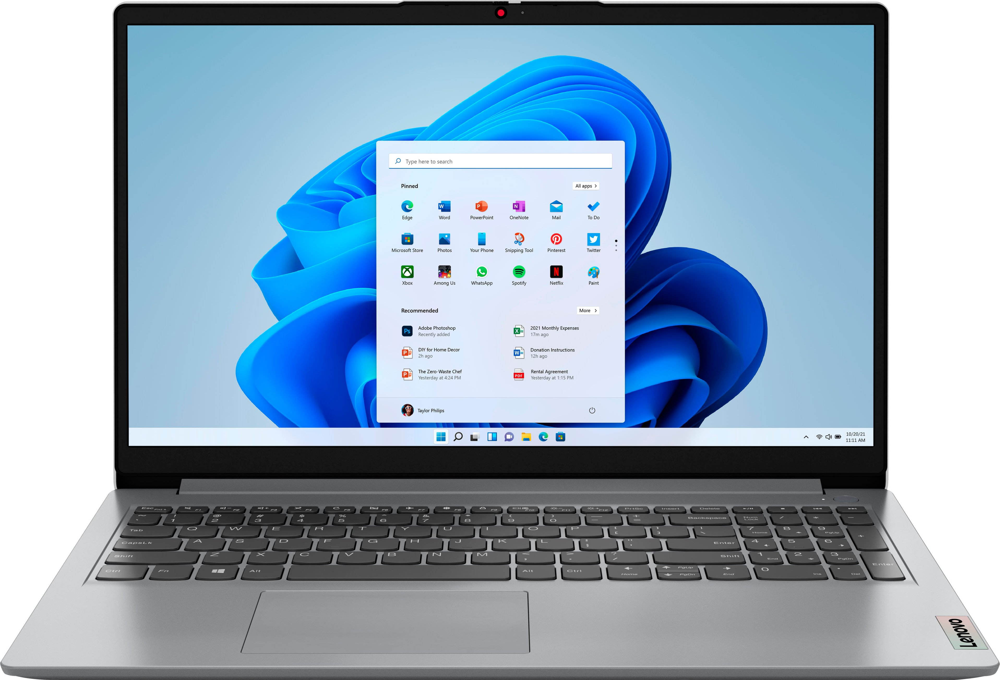
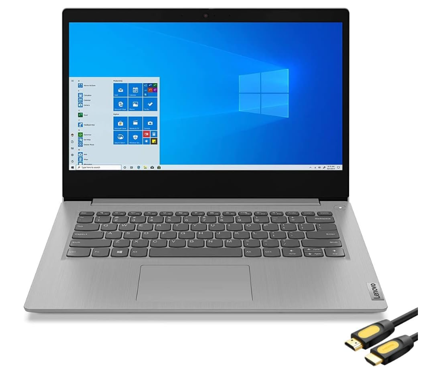
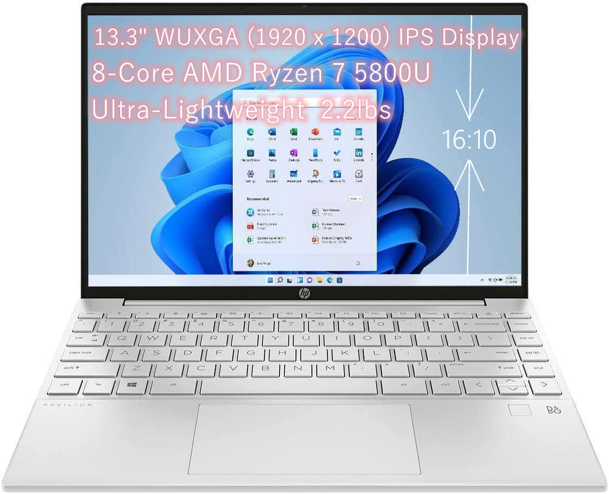

# Final Assignment

## Laptop Recommendations for the Organization

Given the task to review and recommend two laptop options for the organization, we carefully considered the CFO's initial choice and presented two alternatives that offer better resources. Our recommendations provide enhanced performance at competitive price points. 

### CFO's Initial Choice

The CFO initially chose the [Lenovo - Ideapad 1](https://www.bestbuy.com/site/lenovo-ideapad-1-15-6-hd-laptop-athlon-silver-7120u-with-4gb-memory-128gb-ssd-cloud-grey/6531746.p?skuId=6531746). Here are the key specifications:

- CPU: Athlon Silver 7120U
- RAM: 4GB
- SSD: 128GB
- Price: $299.99

### Recommendation 1

The first alternative is [Mike's Lenovo IdeaPad 3i Laptop](https://www.amazon.com/Lenovo-IdeaPad-Business-Student-i3-1115G4/dp/B0BSR6N4WY/ref=sr_1_2_sspa?crid=31ZBEMBLDQUC1&keywords=lenovo%2Blaptop&qid=1689560155&refinements=p_n_feature_thirty-three_browse-bin%3A23720419011&rnid=23720416011&s=pc&sprefix=lenovo%2B%2Caps%2C196&sr=1-2-spons&sp_csd=d2lkZ2V0TmFtZT1zcF9hdGY&th=1):

- CPU: 11th Gen Intel Core i3-1115G4
- RAM: 8GB
- SSD: 512GB
- Price: $319.99

This laptop offers several improvements over the CFO's choice:

1. The 11th Gen Intel Core i3-1115G4 CPU significantly outperforms the Athlon Silver 7120U, enhancing overall performance.
2. It contains double the amount of RAM, promoting efficient multitasking and the smooth running of complex applications.
3. With 512GB of SSD storage, this laptop provides four times the storage space, enabling more room for files and applications.

### Recommendation 2

The second alternative, [HP Pavilion Aero Laptop - 13z-be200](https://www.hp.com/us-en/shop/pdp/hp-pavilion-aero-laptop-13z-be200-133-78f88av-1?&a=1&jumpid=cs_con_nc_ns&utm_medium=cs&utm_source=ga&utm_campaign=HP-Store_US_All_CPS_All_AMD_Google_All_Smart-PLA&utm_content=sp&adid=528037761309&addisttype=u&78F88AV_1&cq_src=google_ads&cq_cmp=13541623146&cq_con=123108433905&cq_term=&cq_med=&cq_plac=&cq_net=u&cq_pos=&cq_plt=gp&gclid=Cj0KCQjwzdOlBhCNARIsAPMwjbx9jw7aPgSnmxy6c7S3mof_dVloiL805sXFI43odHjXJYC21LvaVNIaAshmEALw_wcB&gclsrc=aw.ds), is my recommendation:

- CPU: AMD Ryzen™ 5 7535U (up to 4.55 GHz, 16 MB L3 cache, 6 cores, 12 threads)
- RAM: 8GB
- SSD: 256GB
- Price: $519.99

Compared to the CFO's choice, my recommendation provides:

1. A superior CPU: The AMD Ryzen™ 5 7535U offers high performance, enabling the laptop to handle more demanding tasks.
2. Double the amount of RAM, promoting better multitasking and smoother operation of complex applications.
3. Double the SSD storage, offering ample space for files and applications.
4. Comes with Windows 11 Home, likely offering better security and newer features.

### Final Recommendation

Taking into account both performance and cost, I recommend the Lenovo IdeaPad 3i Laptop as the preferred choice for the organization. While both recommendations offer substantial improvements over the CFO's initial choice, Mike's recommendation provides significantly more storage at a lower cost.

---

